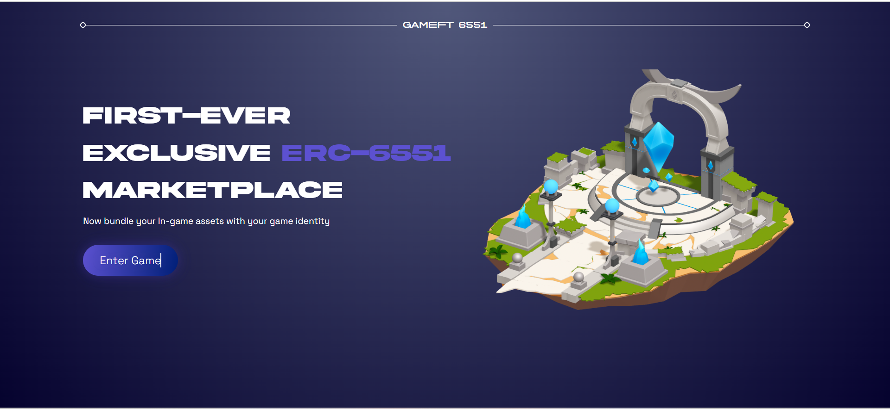

# gameFT-6551

Website Link : [https://game-ft-6551.vercel.app/](https://game-ft-6551.vercel.app/)

Welcome to GameFT-6551, First-Ever
Exclusive erc-6551
Marketplace
Now bundle your In-game assets with your game identity!

## Features

- Innovative Token Standard:- ERC-6551 transforms NFTs into intelligent contracts with smart wallet capabilities.

- Dynamic Gaming Ecosystem:- Immerse yourself in a diverse gaming world where ERC-6551 NFT Profiles act as gateways to various games.

- Customizable Profiles:- Personalize your ERC-6551 NFT Profiles with unique ERC-20, ERC-721, or ERC-1155 assets.

- Token-Gating Features:- Unlock exclusive features by utilizing token-gating, enhancing your gaming experience.

- Future of Blockchain Gaming:- Dive into the cutting-edge GameFi Marketplace, where innovation converges with play.

## Tech Stack

Built with :- NextJS, JavaScript, Tailwind CSS, Thirdweb.

### Sponsers

## AirStack API -

--> This project uses AirStack API, which provides us easily query any data across Polygon blockchain in this Dapp.

## XMTP Messenging -

--> This project uses XMTP Messenging protocol which helps user to invite their friends to our dapp via XMTP invites.

## Waku -

User can alert unlisted NFT Owners to request them to list their NFT according to buyer requirements and User can also negotiate with listed NFT Owners

## User Guide...

- When user visits to our dapp they can create new embadded wallet directly through their social.

- They can mint their profile NFT & start playing the game. This profile NFT will act as wallet for all the asssets they collects!

- After playing the game and collecting the assets if they want, they can sell the profile NFT on marketplace along with all the assets they hold.

- After that they can create more [max 5] profiles NFTs, play games, collect assets and sell on the marketplace.
